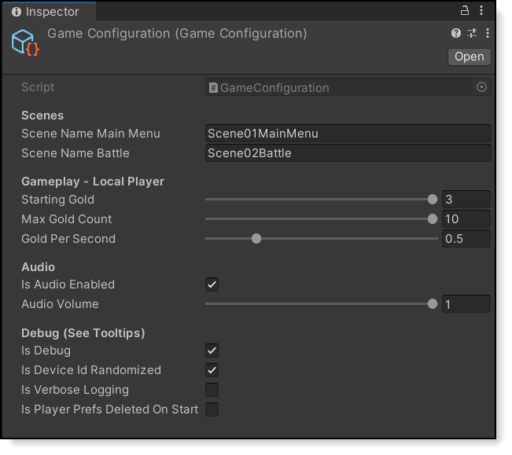

Unity Sample Project
==================


#### Welcome to "Pirate Panic" !

This Unity sample project demonstrates the features of the Nakama Server by Heroic Labs.

[Nakama](https://github.com/heroiclabs/nakama) is an open-source server designed to power modern games and apps. Features include user accounts, chat, social, matchmaker, realtime multiplayer, and much [more](https://heroiclabs.com).


These docs provide everything you need to download the Unity game, run the Nakama server, and play "Pirate Panic".

Enjoy!

## Table Of Contents

- [Nakama Docs](#nakama-docs)
- [Nakama Videos](#nakama-videos)
- [Concepts](#concepts)
    + [Nakama](#nakama)
    + [Pirate Panic Game](#pirate-panic-game)
- [Scenes](#scenes)
    + [Examples](#examples)
    + [Pirate Panic Game](#pirate-panic-game-1)
- [Getting Started](#getting-started)
    + [1. Setup Docker](#1-setup-docker)
    + [2. Setup Unity](#2-setup-unity)
    + [3. Play Against Yourself](#3-play-against-yourself)


## Nakama Docs

* **Nakama** (<a target="_blank" href="https://heroiclabs.com/docs/index.html">Docs<a>) - High-level overview
* **Unity Client Guide** (<a target="_blank" href="https://heroiclabs.com/docs/unity-client-guide/">Docs<a>) - Unity-specific setup

## Nakama Videos

<a target="_blank" href="https://www.youtube.com/watch?v=4F7tQe2pJS0">

</a>

* **Heroic Labs YouTube Channel** (<a target="_blank" href="https://www.youtube.com/channel/UC9vXzwdHUz6EnJFdUiXk_jQ">Videos<a>) - High-level overview
* **Pirate Panic YouTube Playlist** (<a target="_blank" href="https://www.youtube.com/watch?v=4F7tQe2pJS0">Videos<a>) - Everything about "Pirate Panic"


## Concepts

#### Nakama

The Nakama SDK connects one or more Unity game clients to the Nakama Server.


The Unity game clients connects throught the Nakama SDK using industry-standard patterns.


* **Client** (<a target="_blank" href="https://heroiclabs.com/docs/unity-client-guide/#authenticate">Docs</a>) - In Nakama, with a client object you can authenticate against the server. You can register or login a user with one of the authenticate options.
* **Socket** (<a target="_blank" href="https://heroiclabs.com/docs/unity-client-guide/#socket-messages">Docs</a>) - In Nakama, each client can create one or more sockets with the server. Each socket can have it's own event listeners registered for responses received from the server.
* **Account** (<a target="_blank" href="https://heroiclabs.com/docs/user-accounts/">Docs</a>) - In Nakama, the Account contains all the identifying data of a Client, like User Id, linked Device IDs, linked Facebook account, username, etc.
* **Session** (<a target="_blank" href="https://heroiclabs.com/docs/unity-client-guide/#sessions">Docs</a>) - In Nakama, the session is represented with a client-side object that proves that the client was authenticated when accessing server functions.


#### Pirate Panic Game

The Unity Pirate Pananic game client wraps the flexible Nakama SDK concepts into custom solutions such as **GameConnection**.


* **Scene01MainMenuController** (<a target="_blank" href="./PiratePanic/Assets/PiratePanic/Scripts/Scene01MainMenuController.cs">Source</a>) - Handles creation of Client, Socket, Account, and Session for interaction with the Nakama server.
* **GameConnection** (<a target="_blank" href="./PiratePanic/Assets/PiratePanic/Scripts/GameConnection.cs">Source</a>) - Stores references to Client, Socket, Account, and Session for interaction with the Nakama server.
* **GameStateManager** (<a target="_blank" href="./PiratePanic/Assets/PiratePanic/Scripts/GameStateManager.cs">Source</a>) - Manages client-server communication, including MatchState, with the Nakama server.


## Scenes

#### Examples

The repo includes several helpful example scenes which showcase the features of Nakama.


* **Async / Await** (<a target="_blank" href="./PiratePanic/Assets/Examples/Scenes/Example01AsyncAwait/">Source</a>) - Asynchronous programming with async and await. (<a href="https://docs.microsoft.com/en-us/dotnet/csharp/programming-guide/concepts/async/">Microsoft Docs</a>)
* **Authentication** (<a target="_blank" href="./PiratePanic/Assets/Examples/Scenes/Example02Authentication/">Source</a>) - User authentication with Nakama server. (<a href="https://heroiclabs.com/docs/unity-client-guide/#authenticate">Nakama Docs</a>)
* **Chat** (<a target="_blank" href="./PiratePanic/Assets/Examples/Scenes/Example03Chat/">Source</a>) - Realtime chat with Nakama server. (<a href="https://heroiclabs.com/docs/social-realtime-chat/">Nakama Docs</a>)
* **Server Runtime Method** (<a target="_blank" href="./PiratePanic/Assets/Examples/Scenes/Example04ServerRuntimeMethod/">Source</a>) - Fast embedded code runtime with Nakama server. (<a href="https://heroiclabs.com/docs/runtime-code-basics/">Nakama Docs</a>)
* **Authoritative Multiplayer** (<a target="_blank" href="./PiratePanic/Assets/Examples/Scenes/Example05AuthoritativeMultiplayer/">Source</a>) - Realtime multiplayer with Nakama server. (<a href="https://heroiclabs.com/docs/gameplay-multiplayer-server-multiplayer/">Nakama Docs</a>)


#### Pirate Panic Game

The repo includes these scenes for the sample game project.


* **Scene01MainMenu** (<a target="_blank" href="./PiratePanic/Assets/PiratePanic/Scripts/Scene01MainMenuController.cs">Source</a>) - This is the main entry point for the game. **Play this scene first**.
* **Scene02Battle** (<a target="_blank" href="./PiratePanic/Assets/PiratePanic/Scripts/Scene02BattleController.cs">Source</a>) - The core game loop.

## Constants & Configuration

#### Pirate Panic Game

The game centralizes some values which are intended for tweaking and experimentation by game developers.



* **GameConfiguration** (<a target="_blank" href="./PiratePanic/Assets/PiratePanic/Scripts/GameConfiguration.cs">Source</a>) - Stores commonly used values which may be changed at edit-time and runtime.
* **GameConstants** (<a target="_blank" href="./PiratePanic/Assets/PiratePanic/Scripts/GameConstants.cs">Source</a>) - Stores commonly used values which may be changed at edit-time.


## Getting Started

#### 1. Setup Docker

The Docker Engine is required. Follow the Heroic Labs <a href="https://heroiclabs.com/docs/install-docker-quickstart/">quickstart guide</a>.

The command of `docker-compose` makes it simple for the database server and game server to be loaded and started together and updates can be easily downloaded from Docker Hub to upgrade.

To start the game server once Docker is setup navigate to the `.\ServerModules` folder and run:

```
docker-compose up
```

Some other useful docker-compose commands are:

* `down` - will stop all running containers defined by the compose file.
* `down -v` - same as above but will also purge the volumes which store data for the containers.

#### 2. Setup Unity

The Unity Editor is required. Download it from <a href="https://unity3d.com/get-unity/download">Unity3d.com/get-unity/download</a>.

1. Open the Unity Project of `./PiratePanic/` in Unity Version **2020.2.1f1** or higher
1. Open the Unity Console Window (Unity → Windows → General → Console). Confirm there are no warnings or errors


#### 3. Play Against Yourself

**Standalone Build Play Session**
1. Open the project in the Unity Editor
1. Make a Unity Standalone Build (e.g. WindowsStandalone)
1. Run the Standalone Build of Pirate Panic
1. Enter "localhost" for the Server IP within the in-game UI
1. Click "Battle"

**Unity Editor Play Session**
1. Open the project in the Unity Editor
1. Open the scene of `./PiratePanic/Assets/PiratePanic/Scenes/Scene01MainMenu.unity`
1. Run Unity Editor for Pirate Panic
1. Enter "localhost" for the Server IP within the in-game UI
1. Click "Battle"

Now the **Standalone** is playing against the **Unity Editor**. Enjoy!


## Contribute

The collaboration on this code is managed as GitHub issues and pull requests are welcome. If you're interested to enhance the code please open an issue to discuss the changes or drop in and discuss it in the [community forum](https://forum.heroiclabs.com).

To modify the Typescript remote procedure call (RPC) code, install Node Package Manager (NPM), run `npm install` and `npx tsc` from the `ServerModules` folder, and restart the server.

More documentation on working with the Nakama Typescript runtime can be found here: https://heroiclabs.com/docs/runtime-code-typescript-setup/

### License

This project source code and documentation is licensed under the [Apache-2 License](https://github.com/heroiclabs/unity-sampleproject/blob/master/LICENSE). All images, graphics, and other non-code resources are licensed under [CC BY-NC-ND](https://creativecommons.org/licenses/by-nc-nd/4.0/). Please reach out on a GitHub issue if you have any questions.

All 3rd-party assets and libraries used in this project retain all rights under their respective licenses.

.
